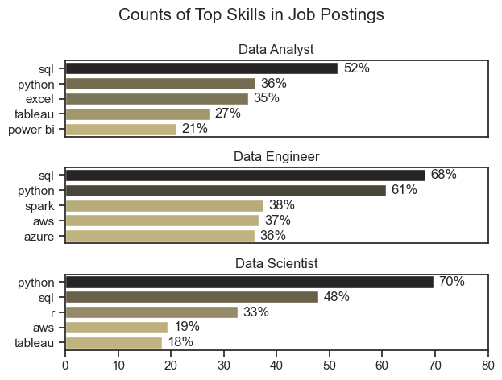
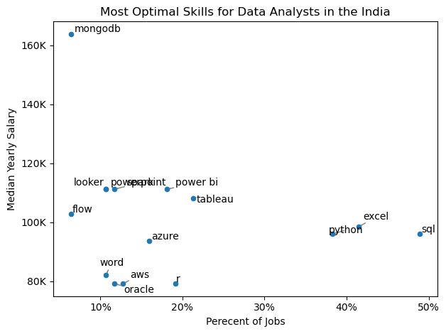

# Data Analyst Job Market Analysis - India

## Overview

This project analyzes the Indian Data Analyst job market to identify:

- Most in-demand skills
- Skill demand trends
- Highest-paying skills
- Optimal skills to learn (high demand + high salary)

The analysis was performed using Python, Pandas, Matplotlib, and Seaborn on job posting data.

---

## Project Structure

```text
3_Project/
├── Images/
│   ├── skill_demand.png
│   ├── Trends.png
│   ├── Analysis.png
│   └── Optimal Skills.png
├── 1_EDA.ipynb
├── 2_Skills.ipynb
├── 3_Trends.ipynb
├── 4_Analysis.ipynb
├── 5_Optimal_Skills.ipynb
└── README.md
```

---

## Tools Used

- Python
- Pandas
- Matplotlib
- Seaborn
- Jupyter Notebook
- VS Code
- Git & GitHub

---

## Dataset Preparation

Key preprocessing steps:

```python
df['job_posted_date'] = pd.to_datetime(df['job_posted_date'])

df['job_skills'] = df['job_skills'].apply(
    lambda x: ast.literal_eval(x) if pd.notna(x) else x
)

df_India = df[df['job_country'] == 'India']
```

---

# Analysis

## 1. Most In-Demand Skills

Identified the top skills required across the most common data roles.



### Key Findings

- SQL is the most requested skill.
- Python is highly demanded across all data roles.
- Data Engineers require more cloud and big-data skills such as AWS and Azure.

---

## 2. Skill Demand Trends

Analyzed how demand for key Data Analyst skills changes over time.


### Key Findings

- SQL remains consistently important.
- Excel continues to appear frequently in job postings.
- Python and Power BI maintain strong demand throughout the year.

---

## 3. Salary Analysis

Compared salaries and identified high-paying skills for Data Analysts.


### Key Findings

- Specialized technical skills command higher salaries.
- SQL and Excel remain the most common skills.
- Python and Tableau provide a strong balance of demand and salary.

---

## 4. Optimal Skills to Learn

Combined salary and demand metrics to identify the best skills for career growth.



### Key Findings

- SQL and Python offer the strongest combination of demand and pay.
- Tableau and Power BI remain valuable visualization tools.
- Database technologies can provide higher earning potential.

---

## Skills Gained

During this project I improved my:

- Data Cleaning
- Exploratory Data Analysis (EDA)
- Data Visualization
- Pandas & NumPy
- Matplotlib & Seaborn
- Business Insight Generation

---

## Conclusion

The Indian Data Analyst market strongly values SQL, Python, and visualization tools such as Tableau and Power BI. Developing skills that are both highly demanded and well-paid can significantly improve career opportunities in analytics.